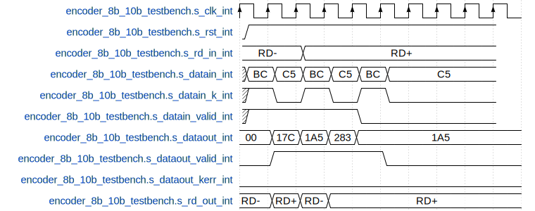

# vcd2wavedrom

This is a python script for transforming a VCD file into a 
[wavedrom](https://wavedrom.com/). Requires 
[vcdvcd](https://github.com/cirosantilli/vcdvcd) and Python 3. 
Optionally requires [wavedrom-cli](https://github.com/wavedrom/cli) 
for converting the wavedrom into an SVG.



## Usage

```
usage: vcd2wavedrom.py [-h] -i INPUT [-o OUTPUT] [-c CONFIGFILE] [-r SAMPLERATE] [-t MAXTIME]
                       [-f OFFSET] [-z HSCALE] [--top]

Transform VCD to wavedrom

optional arguments:
  -h, --help            show this help message and exit
  -i INPUT, --input INPUT
                        Input VCD file
  -o OUTPUT, --output OUTPUT
                        Output Wavedrom file
  -c CONFIGFILE, --config CONFIGFILE
                        Config file
  -r SAMPLERATE, --samplerate SAMPLERATE
                        Sample rate of wavedrom
  -t MAXTIME, --maxtime MAXTIME
                        Length of time for wavedrom
  -f OFFSET, --offset OFFSET
                        Time offset from start of VCD
  -z HSCALE, --hscale HSCALE
                        Horizontal scale
  --top                 Only output the top level signals
```

## Quickstart

Test the example given by running `make` in the project directory.

## Auto configuration

If no configuration file is provided, a default configuration will be
created based on the contents of the vcd file.

## Config options

### Signal

The signal key is appended to the corresponding signal in the wavedrom
output. You can add here wavedrom parameters.

### Filter

You can select which signals are included in the wavedrom output by
adding the signal name to this list. The resulting list is created in
this order. Putting `__all__` in this field will include all signals,
and putting `__top__` will only include the top level signals (this will
be messed up by entity names that have periods).

### Replace

Raw values may be replaced by a more human readable text. See the
example config file for an example.

### Offset

This is the first tick from which sample the vcd waves.

### Samplerate

Should be set to clock period / resolution of simulation.

### Clocks

List of clock signals (high level is replaced by clock edge symbol.

### Maxtime

Sample (or extend last value) until `maxtime`.
